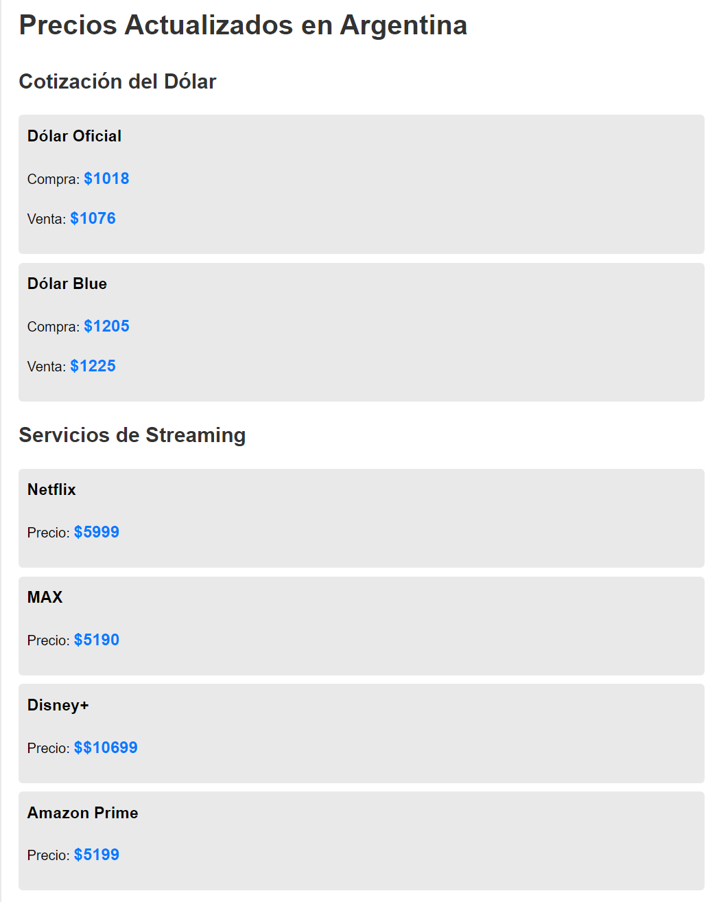

# Proyecto de Extracción de Precios de Servicios de Streaming

Este proyecto tiene como objetivo extraer los precios de suscripción de diferentes servicios de streaming como Prime Video y Disney+ utilizando web scraping y además
extraer el valor del dolar y el dolar BLUE en Argetina 

## Requisitos

- Node.js
- npm (Node Package Manager)

## Dependencias
Este proyecto utiliza las siguientes dependencias:

- axios: Para realizar solicitudes HTTP.
- cheerio: Para realizar web scraping y manipulación del DOM.

## Estructura del Proyecto
- server.js: Archivo principal que contiene la lógica para extraer los precios de los servicios de streaming.

## Funciones Principales

obtenerPrecioPrimeVideo
- Esta función obtiene el precio de suscripción de Prime Video desde su sitio web. Si no se puede extraer un precio válido, se utiliza un valor por defecto de 1599.

obtenerPrecioDisney
- Esta función obtiene el precio de suscripción de Disney+ desde su sitio web. Si no se puede extraer un precio válido, se utiliza un valor por defecto de 1599.

## Manejo de Errores
- En caso de que ocurra un error durante la extracción del precio, se captura el error y se utiliza un valor por defecto de 1599.

